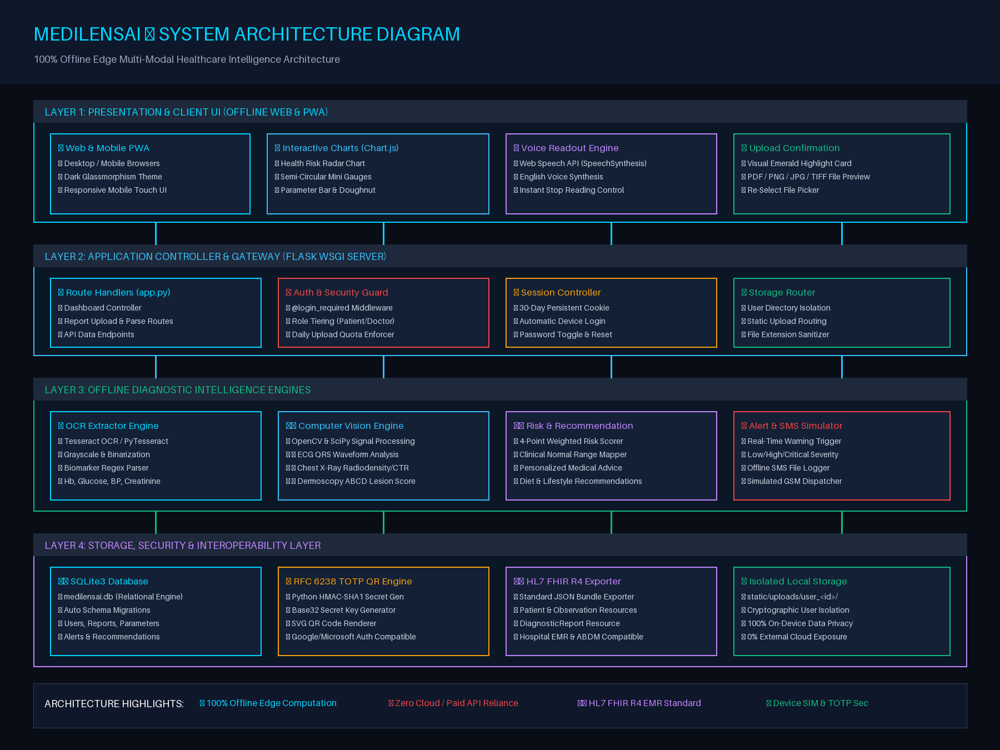

# 🏗️ MediLensAI — System Architecture Specification

This document details the software architecture, component layers, data flow pipelines, and offline design principles for **MediLensAI**.

---

## 🖼️ System Architecture Diagram



---

## 🏛️ Architectural Layers Overview

MediLensAI is built on a **4-tier modular edge architecture** designed for 100% offline operation, high computational throughput, and zero external cloud dependencies.

---

### Layer 1: Client & Presentation Layer (Offline Web & PWA)
- **Web & Mobile PWA**: Built using responsive HTML5 and custom Dark Glassmorphism CSS (`static/css/style.css`).
- **Data Visualization**: Employs Chart.js (`static/js/lib/chart.min.js`) for interactive Health Risk Radar charts, semi-circular mini gauges, and risk doughnut distributions.
- **Voice Synthesis**: Integrates native browser Web Speech API (`SpeechSynthesis`) for English voice readout with instant stop control (`static/js/voice.js`).
- **Visual Upload Confirmation**: Instant emerald green highlight card confirming PDF, PNG, JPG, or TIFF file selection (`static/js/main.js`).

---

### Layer 2: Application Controller & Gateway (Flask WSGI Server)
- **Route Controller (`app.py`)**: Flask WSGI application managing web routes, report uploads, and RESTful API endpoints.
- **Authentication & Authorization**: `@login_required` decorator middleware enforcing row-level security and user role tiering (Patients: 5 uploads/day, Doctors: unlimited).
- **Session Controller**: Configures `PERMANENT_SESSION_LIFETIME = timedelta(days=30)` for persistent 30-day device auto-login.
- **Storage Router**: Routes uploaded files into cryptographically isolated user folders (`static/uploads/user_<id>/`).

---

### Layer 3: Offline Diagnostic Intelligence Engines
- **OCR Extractor Engine (`modules/ocr_extractor.py`)**: OpenCV image preprocessing (grayscale, adaptive thresholding, denoising) + Tesseract OCR (`pytesseract`) biomarker regex parser.
- **Computer Vision Engine (`modules/computer_vision.py`)**:
  - *🫀 ECG Waveform*: Signal peak detection, QRS duration, and rhythm irregularity calculation.
  - *🩻 Chest X-Ray*: Pulmonary radiodensity and Cardiothoracic Ratio (CTR) measurement.
  - *🔍 Dermatology*: Dermoscopy ABCD asymmetry, border regularity, and nevus analysis.
- **Risk & Recommendation Engine (`modules/risk_predictor.py` & `recommendation_engine.py`)**: Weighted 4-point risk scorer (0.0 to 4.0) and targeted clinical advice generator.
- **Alert System & SMS Simulator (`modules/alert_system.py`)**: Trigger mechanism for abnormal biomarkers and local offline SMS log simulator (`sms_simulation_log.txt`).

---

### Layer 4: Storage, Security & Interoperability Layer
- **SQLite3 Database (`database/db.py`)**: Self-contained relational database (`medilensai.db`) handling users, reports, health parameters, alerts, and recommendations with automatic schema migrations.
- **RFC 6238 TOTP Engine (`modules/totp_authenticator.py`)**: HMAC-SHA1 secret key generator and SVG QR code renderer compatible with Google Authenticator and Microsoft Authenticator without internet.
- **HL7 FHIR R4 Exporter (`modules/fhir_exporter.py`)**: Converts diagnostic findings into official HL7 FHIR R4 JSON Bundles for hospital EMR compatibility.
- **Isolated Local File Storage**: User-isolated directory tree guaranteeing 100% data privacy.

---

## 🔄 End-to-End Data Processing Pipeline

```text
[User File Upload] ──> [Flask Controller Validation & Quota Check]
                                      │
                                      ▼
                      [Diagnostic Engine Selection]
         ┌────────────────────────────┼────────────────────────────┐
         ▼                            ▼                            ▼
[Tesseract OCR Engine]    [Computer Vision Engine]     [Dermoscopy Engine]
(Lab Report Extraction)   (ECG / X-Ray Radiometry)     (ABCD Lesion Score)
         └────────────────────────────┼────────────────────────────┘
                                      │
                                      ▼
                      [Clinical Risk & Rec Engine]
                      (Weighted 0-4 Scorer & Rules)
                                      │
                                      ▼
                      [SQLite Persistence & FHIR Gen]
                      (medilensai.db & FHIR R4 JSON)
                                      │
                                      ▼
                      [Interactive UI & Voice Readout]
```
